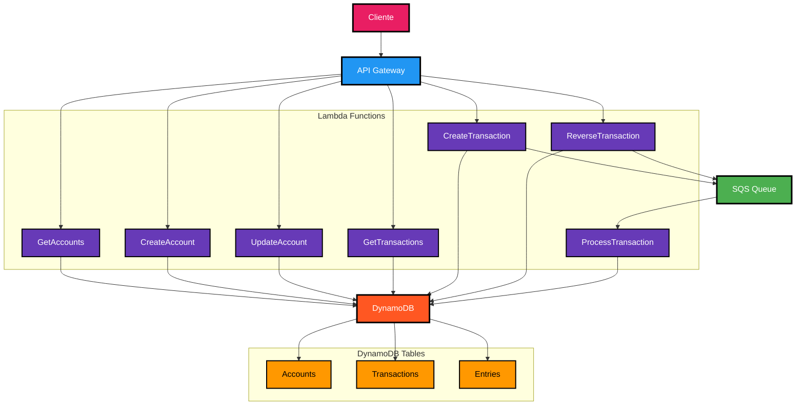

# LedgerTransacional

Um sistema de ledger transacional para gerenciamento de contas e transações financeiras, implementado como uma aplicação serverless na AWS usando .NET 8.

## Visão Geral

O LedgerTransacional é um sistema de contabilidade distribuída que permite:

- Criação e gerenciamento de contas financeiras
- Registro de transações com múltiplas entradas (débito/crédito)
- Manutenção automática de saldos
- Processamento assíncrono de transações
- Consultas com filtros diversos
- Estorno de transações com processamento assíncrono

## Arquitetura



## Estrutura do Projeto

- **LedgerTransacional.Models**: Entidades de domínio, DTOs e objetos de resposta da API
- **LedgerTransacional.Services**: Implementação dos serviços de negócio e interfaces
- **LedgerTransacional.Functions**: Funções AWS Lambda para endpoints e processamento
- **LedgerTransacional.Common**: Componentes compartilhados, constantes e utilitários
- **LedgerTransacional.UnitTests**: Testes unitários para as funcionalidades principais

## Funcionalidades Principais

- **Gestão de Contas**:

  - Criação de contas (`POST /api/v1/accounts`)
  - Listagem de contas com filtros (`GET /api/v1/accounts?type=ASSET&currency=USD&isActive=true`)
  - Atualização de contas existentes (`PUT /api/v1/accounts/{accountId}`)

- **Gestão de Transações**:
  - Criação de transações (`POST /api/v1/transactions`)
  - Listagem de transações com filtros (`GET /api/v1/transactions?startDate=2025-01-01&endDate=2025-12-31&status=COMPLETED&accountId=acc123`)
  - Estorno de transações (`POST /api/v1/transactions/{transactionId}/reverse?description=Descrição opcional do estorno`)
  - Processamento assíncrono de transações via fila SQS (tanto para criação quanto para estorno)

## Fluxo de Processamento de Transações

1. Cliente envia uma requisição para criar uma transação ou estornar uma transação existente
2. A respectiva função Lambda (CreateTransaction ou ReverseTransaction) cria os registros iniciais no DynamoDB com status "PENDING"
3. Em seguida, a função envia uma mensagem para a fila SQS com os detalhes da transação
4. A função ProcessTransaction é acionada automaticamente quando há mensagens na fila
5. O processamento assíncrono executa a transação, atualiza os saldos das contas e altera o status para "COMPLETED"

## Requisitos

- .NET 8.0+
- AWS CLI configurado
- AWS SAM CLI
- PowerShell 7+

## Configuração e Implantação

1. **Clone o repositório**:

   ```
   git clone https://github.com/seu-usuario/LedgerTransacional.git
   cd LedgerTransacional
   ```

2. **Restaure as dependências**:

   ```
   dotnet restore
   ```

3. **Execute o script de implantação**:

   ```powershell
   .\Deploy-LedgerTransacional.ps1
   ```

4. **Acesse os endpoints**:
   Após a implantação, o script exibirá os endpoints disponíveis.

## Modelo de Dados

### Contas (Accounts)

- **AccountId**: Identificador único
- **Name**: Nome da conta
- **Type**: Tipo da conta (ASSET, LIABILITY, EQUITY, INCOME, EXPENSE)
- **Currency**: Moeda da conta (USD, EUR, BRL, etc.)
- **CurrentBalance**: Saldo atual
- **IsActive**: Status de ativação
- **CreatedAt/UpdatedAt**: Timestamps

### Transações (Transactions)

- **TransactionId**: Identificador único
- **ReferenceId**: Referência externa opcional
- **TransactionDate**: Data da transação
- **Description**: Descrição
- **Status**: Status (PENDING, COMPLETED, FAILED, REVERSED)
- **TotalAmount**: Valor total
- **Currency**: Moeda
- **Metadata**: Dados adicionais (chave-valor)

### Entradas (Entries)

- **EntryId**: Identificador único
- **TransactionId**: ID da transação relacionada
- **AccountId**: ID da conta afetada
- **EntryType**: Tipo (DEBIT, CREDIT)
- **Amount**: Valor
- **Description**: Descrição

## CI/CD Pipeline

O projeto utiliza GitHub Actions para integração e implantação contínuas:

### Workflow de CI (.github/workflows/build-test.yml)

Acionado em:

- Push para a branch main
- Pull requests para a branch main

Etapas:

1. Checkout do código
2. Configuração do .NET 8
3. Restauração de dependências
4. Compilação da solução
5. Execução de testes unitários
6. Upload de artefatos de build (quando em branch main)

### Workflow de CD (.github/workflows/deploy.yml)

Acionado quando:

- O workflow de CI é concluído com sucesso na branch main

Etapas:

1. Checkout do código
2. Configuração do .NET 8
3. Configuração de credenciais AWS
4. Configuração do AWS SAM CLI
5. Restauração de dependências
6. Compilação da solução
7. Build do template SAM
8. Deploy para AWS
